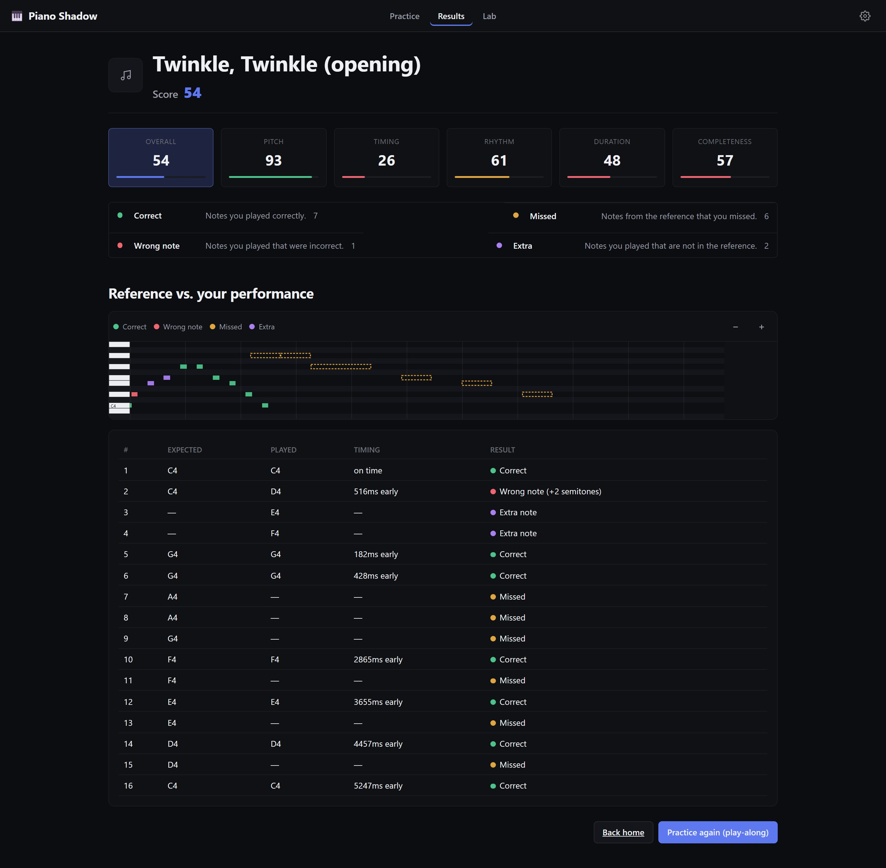

# Piano Shadow

A browser-first piano practice app. Import a reference performance, follow it on
a virtual keyboard or a real MIDI controller, and get precise, explainable
feedback on pitch, timing, rhythm, duration, missed notes, and extra notes.

> Turn a reference performance into a reusable practice template, then explain
> exactly how you differed from it.





**Live app:** https://piano-shadow.pages.dev

The core is the **Web Practice MVP** described in
[`doc/PIANO_SHADOW_GOAL.md`](doc/PIANO_SHADOW_GOAL.md). The original spec's
microphone-based "Listen" idea was demoted early: real-piano recognition
accuracy wasn't there, so **MIDI import + virtual keyboard/Web MIDI input**
became the core path instead, and microphone recognition kept going as an
isolated, explicitly-experimental diagnostic surface (see *Secondary
surfaces* and *Known limitations* below) — this was a deliberate call, not
an unfinished one. **v0.3.0** rebuilt the Practice page into a continuous
workspace with a full 88-key keyboard; see *Roadmap* below for what shipped
after that. See [`doc/ARCHITECTURE.md`](doc/ARCHITECTURE.md) for how it's
built and [`CHANGELOG.md`](CHANGELOG.md) for the full detail on every release.

## Implemented features

- **Import** a Standard MIDI File (`.mid`/`.midi`), or start from the
  built-in demo (Beethoven's Für Elise) — no file required to try the app.
- **Piano Roll**: time/pitch axes, a pitch-aligned keyboard gutter, zoom, a
  synchronized playhead, and a reference-vs-learner result overlay on Results.
- **Playback**: play/pause/seek, tempo scale (25%–200%), metronome, count-in
  — all driven from one clock so the playhead can never drift.
- **Sound**: reference playback and every learner input (on-screen keyboard,
  live Web MIDI, recognised notes) sound through a shared sampled grand piano
  (`smplr`), with a transparent synth fallback if samples can't load and a
  Sound on/off switch.
- **Input**: a full-size 88-key (A0–C8) on-screen keyboard (mouse/touch + QWERTY
  shortcuts) that **scales to fit the viewport** — no page side-scroll on a
  phone — and an optional Web MIDI device, behind the same input interface.
  An "Input latency compensation" setting shifts recorded onsets to cancel
  device/OS delay before scoring.
- **On-keyboard guidance**: the current target note (accent colour) and the
  next onset group (muted, unfilled) are labelled directly above the keys
  that play them — no separate falling-notes canvas, so nothing shifts when
  a song loads (honours `prefers-reduced-motion`).
- **Practice modes**: Listen (highlight only), Play Along (record + score on
  finish, with live feedback), Wait Mode (pauses at the next note/chord until
  you play it). **Per-hand practice**: restrict playback and scoring to the
  left or right hand (inferred from the MIDI file's tracks or a pitch split).
- **Settings bar**: one header bar (Mode / Hands / Tempo / Input / More) docked
  in the nav on the Practice route, above the transport — opens one category
  at a time in a fixed-height slot (nothing else on the page shifts) and
  auto-closes after 10s idle.
- **Practice workspace**: imported staff notation is the primary Score surface;
  the MIDI Library flips into the same workspace, while the independently
  scrollable 88-key keyboard dock stays in place.
- **Staff notation** (imported MIDI only): a VexFlow grand staff renders inside
  the Score surface — display-only, an approximation of the file's rhythm,
  declined for recorded/recognised takes.
- **Scoring**: deterministic sequence alignment (never index-based — a missed
  or extra note never shifts what comes after it) and five independent
  category scores — Pitch, Timing, Rhythm, Duration, Completeness — plus
  Overall, all explainable from the note-level results.
- **Results**: score breakdown, a colored reference/learner Piano Roll overlay,
  and a full per-note table (expected vs. played vs. timing vs. result).
- **Local persistence** (IndexedDB): imported songs, every attempt's full score
  breakdown, and your settings. No login, no cloud.

## Secondary surfaces (not on the main Practice path)

The main path is Practice → (Score or Library) → Results. Everything below is
reachable but deliberately one step removed — via the header settings bar's
**More** category on Practice, or the nav's **Settings** menu on every other
page:

- **Advanced** (`/experiments`) — browser capability checks (Web MIDI / Web
  Audio support, sample rate, base latency) and the manual **input latency
  compensation** field (−200…500&nbsp;ms) that shifts recorded onsets to
  cancel device/OS delay before scoring.
- **Diagnostics** (`/lab`, "Recognition diagnostics" — the Microphone Lab) —
  mic permission flow, live capture, two pitch recognizers (Pitchy, Basic
  Pitch), latency measurement, and a MIDI-ground-truth comparison reusing the
  practice engine's own scoring. Experimental; see *Known limitations* below.

One more surface exists in the code but currently has **no UI entry point at
all**: `DebugPanel` (`src/components/debug/DebugPanel.tsx`) and its
`showDebugPanel` store flag/persistence are implemented and unit-tested, but
the toggle that used to open it (in both the old nav overflow menu and
`HeaderSettings`' More page) was removed with nothing put in its place — for
now the only way to see it is `useAppStore.getState().setShowDebugPanel(true)`
from devtools.

## Architecture overview

Single Vite + React + TypeScript app with **enforced internal module
boundaries** (ESLint fails a build on an upward import) instead of a
multi-package monorepo — see [`doc/ARCHITECTURE.md`](doc/ARCHITECTURE.md) for
the full module map and the reasoning behind the sequence aligner, the
timing/rhythm split, and the single-clock playback design.

```
music-model → midi/quantization → practice-engine → playback-engine
                                                   ↘   ↗ audio-engine
                                       device-adapters → stores/services → components/pages
```

## Installation

```bash
npm install
```

## Development

```bash
npm run dev          # Vite dev server at http://localhost:5173
```

## Testing

```bash
npm run test          # unit + integration tests (Vitest)
npm run test:watch     # watch mode
npm run test:coverage  # with coverage
npm run typecheck      # TypeScript, no emit
npm run lint            # ESLint, including the architectural boundary rules

npm run test:e2e:install  # one-time: installs the Playwright Chromium browser
npm run test:e2e           # end-to-end tests (builds + serves a production build first)
```

To run a single test file: `npx vitest run src/practice-engine/SequenceAligner.test.ts`.
To run a single Playwright test: `npx playwright test -g "load demo, play along"`.

## Build

```bash
npm run build    # typecheck + production build -> dist/
npm run preview   # serve the production build locally
```

## Deployment

The build is a static site, deployable to any static host. `VITE_BASE=/your-subpath/`
targets a sub-path host (e.g. a GitHub Pages project site); the default `/` suits
Cloudflare Pages or Vercel.

**Cloudflare Pages** (live at **https://piano-shadow.pages.dev**; `wrangler.toml`
is already configured; SPA routing via `public/_redirects`):

```bash
npm run deploy    # npm run build && wrangler pages deploy dist --project-name piano-shadow
```

A GitHub Actions workflow (`.github/workflows/deploy.yml`) deploys the same way
on every push to `main`, given repo secrets `CLOUDFLARE_API_TOKEN` and
`CLOUDFLARE_ACCOUNT_ID`. `.github/workflows/ci.yml` runs typecheck/lint/unit
tests/build and the E2E suite on every push and PR.

**GitHub Pages** needs a 404.html SPA fallback instead of `_redirects` — use
`npm run build:ghpages` (adds `dist/404.html`) rather than `npm run build`. The
two are separate scripts because Cloudflare Pages treats a `404.html` in the
output as an explicit custom-error page and stops honoring `_redirects`'
`200` rewrite for it, so shipping both fallbacks in the same `dist/` breaks
Cloudflare's routing.

## Browser compatibility

Targets current Chrome, Edge, and Firefox. Playback (Tone.js / Web Audio) and
the virtual keyboard work everywhere. **Web MIDI** is Chromium-only as of this
writing (Chrome, Edge, Opera) — Safari and Firefox do not implement it. The app
detects this and never requires Web MIDI: on an unsupported browser the MIDI
panel says so and the virtual keyboard remains fully usable. Web MIDI (and
therefore autoplay-restricted audio) requires a secure context — `localhost`
in development, HTTPS in production.

## Project structure

```
src/
  music-model/       canonical NoteEvent/Performance types + helpers
  midi/               Standard MIDI File import, the built-in demo (Für Elise)
  practice-engine/     sequence alignment, timing/rhythm analysis, scoring
  playback-engine/     Tone.js transport wrapper, the single playback clock
  device-adapters/     virtual keyboard + Web MIDI input, performance recorder
  quantization/        grid-snap helper for a future Teach Mode
  recognition/          Microphone Lab recognizers (Pitchy, Basic Pitch) — experimental,
                         not wired into Practice; see doc/MICROPHONE_LAB_FINDINGS.md
  services/             IndexedDB persistence
  stores/                Zustand app store — wires the above together
  components/, pages/     the UI
tests/
  integration/           cross-module pipeline tests
  e2e/                    Playwright end-to-end tests
doc/                      product spec, architecture doc, screenshots
```

## Known limitations

These are implemented but intentionally incomplete — scoped follow-up work,
not bugs to fix in passing:

- The metronome and count-in follow the reference file's **first tempo
  marking only** — a mid-piece tempo change is not yet reflected in the click
  grid (the pitch/timing/rhythm scoring itself is unaffected, since that is
  derived per-note from the imported MIDI, not from the click grid).
- **Wait Mode** resumes on a monophonic note or a simultaneous-onset chord
  match; it does not enforce a specific note-by-note voicing order within a
  chord.
- Sequence alignment is an O(m·n) dynamic program; correctness-first for MVP
  song sizes. A very large MIDI file (thousands of notes) would benefit from
  moving evaluation to a Web Worker — not needed at the sizes tested here.
- **Microphone recognition is experimental and unvalidated on real pianos.**
  It is intentionally **not part of the Practice page**. The experimental
  `/lab` page benchmarks **only monophonic (single-note) recognition via
  Pitchy** — chords and polyphonic passages need MIDI or MIDI import, and the
  lab UI says so on every microphone surface. The live real-microphone/real-piano
  validation session required by spec §36 / `ROUND_3_REQUIREMENTS.md` §D.1
  (measuring pitch accuracy and onset latency on real audio, with a
  ≥~90% / <~80 ms decision checkpoint) has **not** been run; the synthetic
  benchmark hits 100% on clean tones, which is a ceiling, not a real-world
  number. A specific known failure: on a **sustained** note the McLeod Pitch
  Method locks onto a subharmonic, so long notes are often reported an octave
  (sometimes a fifth) too low — left for the recognition round. A manual
  latency-offset setting exists (v0.7.0), but a guided
  tap-to-calibrate flow (§D.2.4) and a feature-flag opt-in are still open. `/lab`
  ("Recognition diagnostics" in Settings) still benchmarks Pitchy and Basic
  Pitch against synthetic audio and MIDI ground truth — see
  [`doc/MICROPHONE_LAB_FINDINGS.md`](doc/MICROPHONE_LAB_FINDINGS.md).
- Teacher-recording transcription and an ESP32 adapter remain reserved by
  their interfaces but not implemented, per spec §16/§17.

## Roadmap

**v0.2 — Microphone Lab** (spec §36) shipped: permission flow, `AudioWorklet`
capture, two recognizers, latency measurement, confidence visualization, and
MIDI-ground-truth comparison (reusing the existing `practice-engine`), all in an
isolated `/lab` page.

**v0.3 — Practice workspace redesign** (Phase C of
[`doc/ROUND_3_REQUIREMENTS.md`](doc/ROUND_3_REQUIREMENTS.md)) shipped: the
continuous Practice workspace, a full 88-key keyboard, a three-item nav, and a
rebuilt Results page — presentation only, no engine changes.

**v0.4 — Single-page recognition & practice (historical)**
([`doc/SINGLE_PAGE_RECOGNITION_PLAN.md`](doc/SINGLE_PAGE_RECOGNITION_PLAN.md))
was the earlier single-page direction: `Listen` to recognise playing into a
MIDI song, a shared Practice / Export / Delete library, and inline results.
The current Practice workspace removes that recognition panel; microphone
experiments remain isolated at `/lab` until real-piano validation passes.

**v0.4.1 → v0.8.0 — bug fixes + pianokits-inspired features**
([`doc/` plan `fizzy-honking-heron`](doc/ARCHITECTURE.md)) shipped in three
merge waves: **v0.4.1** — recognition-clock fix (recognised notes no longer ring
forever), scale-to-fit keyboard, restored E2E regressions;
**v0.5.0** — sampled piano audio + audible input; **v0.6.0** — falling-notes
guide; **v0.7.0** — per-hand practice + multi-track export + input-latency
compensation; **v0.8.0** — VexFlow staff-notation view (imported MIDI,
display-only).

**v0.9.0 — Score / Library flip workspace** (2026-09-10, plan
[`doc/UI_OPTIMIZATION_PLAN.md`](doc/UI_OPTIMIZATION_PLAN.md)) shipped: the
Practice page's Score and the MIDI Library flip between two faces of one
workspace instead of separate views, with the keyboard dock staying put
across the flip.

**Unreleased — simplify the Practice surface** (see `CHANGELOG.md` for the
full write-up) shipped: `HeaderSettings` docked directly in the nav bar
instead of a row below it; the microphone recognition panel removed from the
main Practice flow (still reachable at Settings → Diagnostics / `/lab`); the
separate falling-notes canvas replaced by on-keyboard note labels; long
imported scores render lazily in VexFlow instead of being capped at 64 bars;
the Debug-panel toggle removed from the UI with no replacement entry point
(see *Secondary surfaces* above).

**Open — validate microphone recognition on real audio.** Still gated (spec §36,
`ROUND_3_REQUIREMENTS §D.1`) on a live microphone/real-piano session measuring
Pitchy's pitch accuracy and onset latency, with a ≥~90% / <~80 ms decision
checkpoint. Until it passes, microphone input stays labeled experimental and
monophonic-only. A manual input-latency offset now exists (v0.7.0); a **guided
tap-to-calibrate** flow (§D.2.4) and a feature-flag opt-in are still open.
`MicrophoneAdapter` now has unit tests (v0.4.1); the deleted route-based E2E
regressions are restored (v0.4.1). See
[`doc/MICROPHONE_LAB_FINDINGS.md`](doc/MICROPHONE_LAB_FINDINGS.md).

Also tracked for later: Wait Mode chord voicing order, an A/B practice loop,
per-tempo-map metronome, richer Piano Roll overlays, and PixiJS/WebGL rendering
if a very large score's Piano Roll needs it (the current Canvas 2D renderer is
isolated behind a component boundary specifically so it can be swapped later).

## License

MIT.
