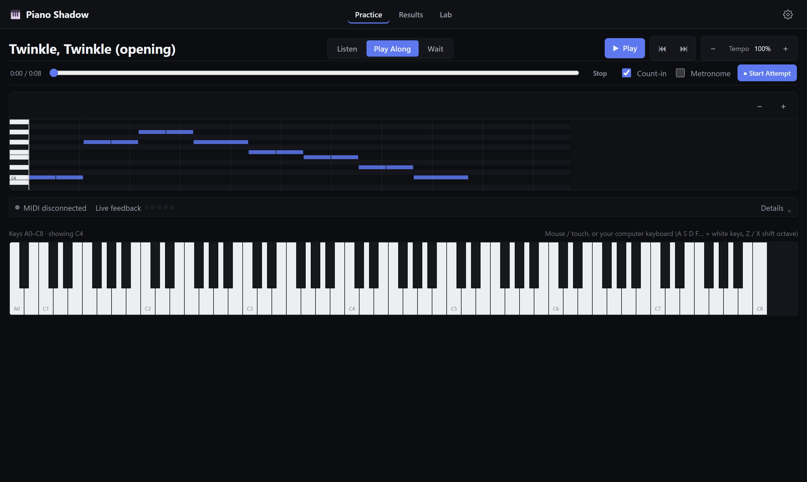
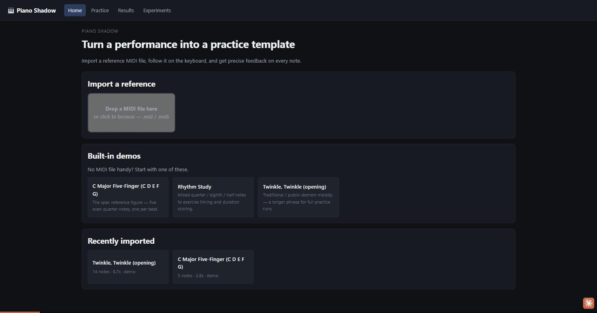

# Piano Shadow

A browser-first piano practice app. Import a reference performance, follow it on
a virtual keyboard or a real MIDI controller, and get precise, explainable
feedback on pitch, timing, rhythm, duration, missed notes, and extra notes.

> Turn a reference performance into a reusable practice template, then explain
> exactly how you differed from it.





**Live app:** https://piano-shadow.pages.dev

This is **v0.1, the Web Practice MVP** described in
[`doc/PIANO_SHADOW_GOAL.md`](doc/PIANO_SHADOW_GOAL.md). See
[`doc/ARCHITECTURE.md`](doc/ARCHITECTURE.md) for how it's built and
[`CHANGELOG.md`](CHANGELOG.md) for what shipped in this release.

## Implemented features

- **Import** a Standard MIDI File (`.mid`/`.midi`), or start from one of three
  built-in demo melodies — no file required to try the app.
- **Piano Roll**: time/pitch axes, a pitch-aligned keyboard gutter, zoom, a
  synchronized playhead, and a reference-vs-learner result overlay on Results.
- **Playback**: play/pause/stop/seek/restart, tempo scale (25%–200%),
  metronome, count-in — all driven from one clock so the playhead can never drift.
- **Input**: an on-screen keyboard (mouse/touch + QWERTY shortcuts) and an
  optional Web MIDI device, behind the same input interface.
- **Practice modes**: Listen (highlight only), Play Along (record + score on
  finish, with live feedback), Wait Mode (pauses at the next note/chord until
  you play it).
- **Scoring**: deterministic sequence alignment (never index-based — a missed
  or extra note never shifts what comes after it) and five independent
  category scores — Pitch, Timing, Rhythm, Duration, Completeness — plus
  Overall, all explainable from the note-level results.
- **Results**: score breakdown, a colored reference/learner Piano Roll overlay,
  and a full per-note table (expected vs. played vs. timing vs. result).
- **Local persistence** (IndexedDB): imported songs, every attempt's full score
  breakdown, and your settings. No login, no cloud.
- **Debug panel** (off by default): playhead, active notes, last MIDI event,
  matching decisions — for diagnosing timing issues.

## Architecture overview

Single Vite + React + TypeScript app with **enforced internal module
boundaries** (ESLint fails a build on an upward import) instead of a
multi-package monorepo — see [`doc/ARCHITECTURE.md`](doc/ARCHITECTURE.md) for
the full module map and the reasoning behind the sequence aligner, the
timing/rhythm split, and the single-clock playback design.

```
music-model → midi/quantization → practice-engine → playback-engine
                                                   ↘
                                       device-adapters → stores/services → components/pages
```

## Installation

```bash
npm install
```

## Development

```bash
npm run dev          # Vite dev server at http://localhost:5173
```

## Testing

```bash
npm run test          # unit + integration tests (Vitest)
npm run test:watch     # watch mode
npm run test:coverage  # with coverage
npm run typecheck      # TypeScript, no emit
npm run lint            # ESLint, including the architectural boundary rules

npm run test:e2e:install  # one-time: installs the Playwright Chromium browser
npm run test:e2e           # end-to-end tests (builds + serves a production build first)
```

To run a single test file: `npx vitest run src/practice-engine/SequenceAligner.test.ts`.
To run a single Playwright test: `npx playwright test -g "load demo, play along"`.

## Build

```bash
npm run build    # typecheck + production build -> dist/
npm run preview   # serve the production build locally
```

## Deployment

The build is a static site, deployable to any static host. `VITE_BASE=/your-subpath/`
targets a sub-path host (e.g. a GitHub Pages project site); the default `/` suits
Cloudflare Pages or Vercel.

**Cloudflare Pages** (live at **https://piano-shadow.pages.dev**; `wrangler.toml`
is already configured; SPA routing via `public/_redirects`):

```bash
npm run deploy    # npm run build && wrangler pages deploy dist --project-name piano-shadow
```

A GitHub Actions workflow (`.github/workflows/deploy.yml`) deploys the same way
on every push to `main`, given repo secrets `CLOUDFLARE_API_TOKEN` and
`CLOUDFLARE_ACCOUNT_ID`. `.github/workflows/ci.yml` runs typecheck/lint/unit
tests/build and the E2E suite on every push and PR.

**GitHub Pages** needs a 404.html SPA fallback instead of `_redirects` — use
`npm run build:ghpages` (adds `dist/404.html`) rather than `npm run build`. The
two are separate scripts because Cloudflare Pages treats a `404.html` in the
output as an explicit custom-error page and stops honoring `_redirects`'
`200` rewrite for it, so shipping both fallbacks in the same `dist/` breaks
Cloudflare's routing.

## Browser compatibility

Targets current Chrome, Edge, and Firefox. Playback (Tone.js / Web Audio) and
the virtual keyboard work everywhere. **Web MIDI** is Chromium-only as of this
writing (Chrome, Edge, Opera) — Safari and Firefox do not implement it. The app
detects this and never requires Web MIDI: on an unsupported browser the MIDI
panel says so and the virtual keyboard remains fully usable. Web MIDI (and
therefore autoplay-restricted audio) requires a secure context — `localhost`
in development, HTTPS in production.

## Project structure

```
src/
  music-model/       canonical NoteEvent/Performance types + helpers
  midi/               Standard MIDI File import, built-in demo melodies
  practice-engine/     sequence alignment, timing/rhythm analysis, scoring
  playback-engine/     Tone.js transport wrapper, the single playback clock
  device-adapters/     virtual keyboard + Web MIDI input, performance recorder
  quantization/        grid-snap helper for a future Teach Mode
  recognition/          NoteRecognizer interface only (spec §15, not implemented)
  services/             IndexedDB persistence
  stores/                Zustand app store — wires the above together
  components/, pages/     the UI
tests/
  integration/           cross-module pipeline tests
  e2e/                    Playwright end-to-end tests
doc/                      product spec, architecture doc, screenshots
```

## Known limitations

- The metronome and count-in follow the reference file's **first tempo
  marking only** — a mid-piece tempo change is not yet reflected in the click
  grid (the pitch/timing/rhythm scoring itself is unaffected, since that is
  derived per-note from the imported MIDI, not from the click grid).
- **Wait Mode** resumes on a monophonic note or a simultaneous-onset chord
  match; it does not enforce a specific note-by-note voicing order within a
  chord.
- Sequence alignment is an O(m·n) dynamic program; correctness-first for MVP
  song sizes. A very large MIDI file (thousands of notes) would benefit from
  moving evaluation to a Web Worker — not needed at the sizes tested here.
- No microphone input, teacher-recording transcription, or ESP32 adapter —
  reserved by their interfaces (`NoteRecognizer`, `NoteInputAdapter`) but not
  implemented, per spec §15/§16/§17.

## Roadmap

**v0.2 — Microphone Lab** (next milestone, spec §36): microphone permission
flow, single-note pitch detection baseline, a Basic Pitch benchmark, latency
measurements, and comparison against MIDI ground truth — evaluated before any
microphone code merges into the stable practice path.

Also tracked for later, once v0.1's acceptance criteria are fully exercised in
practice: Wait Mode chord voicing order, an A/B practice loop, richer Piano
Roll overlays, and PixiJS/WebGL rendering if a very large score's Piano Roll
needs it (the current Canvas 2D renderer is isolated behind a component
boundary specifically so it can be swapped later).

## License

MIT.
