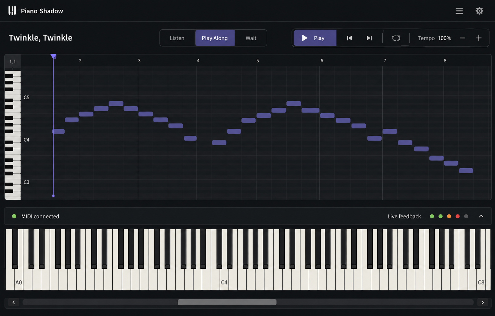
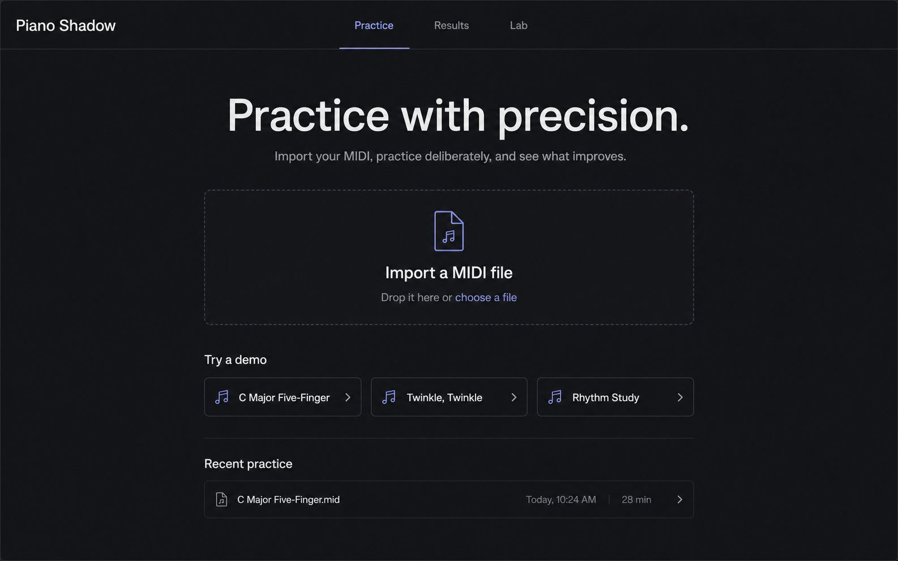
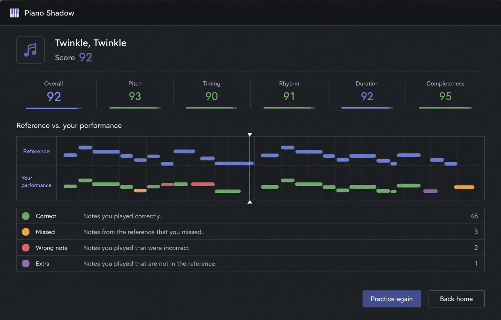

# UI Reference Images

Generated visual references for the UI modernization work.

## Practice workspace

Focus: a centered practice flow with Piano Roll, compact transport controls, and a full-size 88-key keyboard.

## Home page

Focus: a single primary MIDI import action, with demos and recent practice kept secondary.

## Results page

Focus: score summary, reference-vs-performance comparison, and a clear next action.
